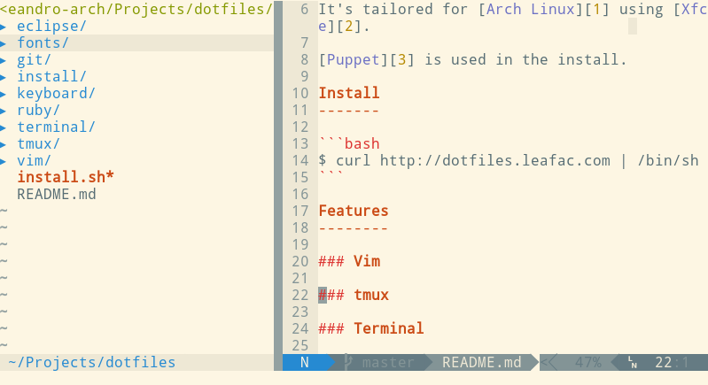

dotfiles
========

This repository holds the configurations of my development machine.

It allows me to share the same configs among my machines with history of changes.

It's tailored for [Arch Linux](http://www.archlinux.org/) using [Xfce](http://www.xfce.org/). It doesn't aim to be compatible with diverse environments, as it was made only for my personal use. But if you want to fork this repository and give it a go, you're welcome to do so.

Install
-------

```bash
$ curl http://dotfiles.leafac.com | /bin/sh
```

Update
------

Whenever there are new configurations in this repository:

```bash
$ cd .../path/to/dotfiles
$ git pull
$ ./install.sh
```

Features
--------

### Puppet

All the installation process is handled by [Puppet](http://puppetlabs.com/).

Every folder in this repository (except for `eclise` and `images-for-README`) are [Puppet Modules](http://docs.puppetlabs.com/puppet/2.7/reference/modules_fundamentals.html).

There's a `install.sh` script to call Puppet with the correct parameters. It first runs a bootstrap checking if Puppet is installed along with [Git](http://git-scm.com/) and everything else that is needed. Then it runs the `install` module.

The `install.sh` script can be run any number of times, as it can perform incremental updates, thanks to how Puppet works. So, if there are any updates, you just need to run it again.

### Install module

It's responsible for installing packages and [Gems](http://rubygems.org/).

It includes all other modules for the complete install.

### Vim



* [Vundle](https://github.com/gmarik/vundle) for dependency management.
* [Solarized](http://ethanschoonover.com/solarized) colorscheme.
* Remap `<leader>` to `,` for ease of use.
* OS clipboard integration. Change to _pastemode_ with `F2`.
* Reloads configs with `,r`. Install new Bundles with `,R`.
* Sensible default for indentation. `:Stab` function for changing `tabstop`, `softtabstop` and `shiftwidth` to the same value at once. [Learn about this](http://vimcasts.org/episodes/tabs-and-spaces/).
* Avoid typos like `:W` or hitting `;` instead of holding `shift` for `:`.
* `:w!!` to salve write protected files.
* Easy split in windows with `,|` and `,-`.
* Easy navigation in windows with `ctrl + [hjkl]` and tabs with `ctrl + [hl]`.
* Smart placement of temporary files. All `.swp` are placed in a folder separate from the current folder.
* Disable arrow keys for best practices.
* Many awesome plugins already installed and configured!
    * `,a` for search with [ack](http://betterthangrep.com/).
    * `,fr` and `,fi` for handling links in [Markdown](http://daringfireball.net/projects/markdown/) files using [formd](http://drbunsen.github.com/formd/).
    * `,u` for Vim undo tree navigation with [Gundo](http://sjl.bitbucket.org/gundo.vim/).
    * `,m` for [NERDTree](https://github.com/scrooloose/nerdtree).
    * `,=<space>` for aligning with [tabular](https://github.com/godlygeek/tabular).
    * ...

---

Check `vim/files/config` for a full list of features. Configs are arranged in separate files for better organization and well commented.

### tmux


* Beautiful status bar.
* Change prefix to `ctrl + a` because it's easier to reach on regular keyboards.
* `<prefix>r` to reload configs.
* `<prefix>-` and `<prefix>|` for splitting panes. These are easier to remember.
* OS clipboard integration. `<prefix><esc>` for getting in selection mode. `v` starts the selection and `y` finishes it. Then `<prefix>y` sends the selected text to the clipboard and `<prefix>p` pastes in tmux.

### Terminal

* [Solarized colors](https://github.com/sgerrand/xfce4-terminal-colors-solarized/blob/master/light/terminalrc) for [Xfce Terminal](http://docs.xfce.org/apps/terminal/start).
* zsh with lots of plugins using [oh-my-zsh](https://github.com/robbyrussell/oh-my-zsh).
* Minimalistic prompt with just the current path on the right and the current Git branch, if any.
* All important places in path, like gem binaries.

### Keyboard

* Remap Caps Lock to Escape. This saves **a lot** of time.

### Ruby

* Don't install `rdoc` from gems, only `ri` because [it's useful](http://jstorimer.com/ri.html).
* Auto-complete in `irb`.

### Git

* Sensible global ignores.
* Nice default commit message :laughing:

---

**Note**: in `git/templates/config.erb` there's my name and e-mail. You should change this before using this dotfiles.

### Fonts

* Patched Droid fonts from https://gist.github.com/2324335 for vim-powerline.

### Eclipse

* [Google Style Guide for Java as a Eclipse Formatter](http://code.google.com/p/google-styleguide/source/browse/trunk/eclipse-java-google-style.xml).

---

**Note**: this isn't installed automatically. You need to import it manually in Eclipse. Damn GUIs :smile:

---


Thanks for the meme, Allan!
